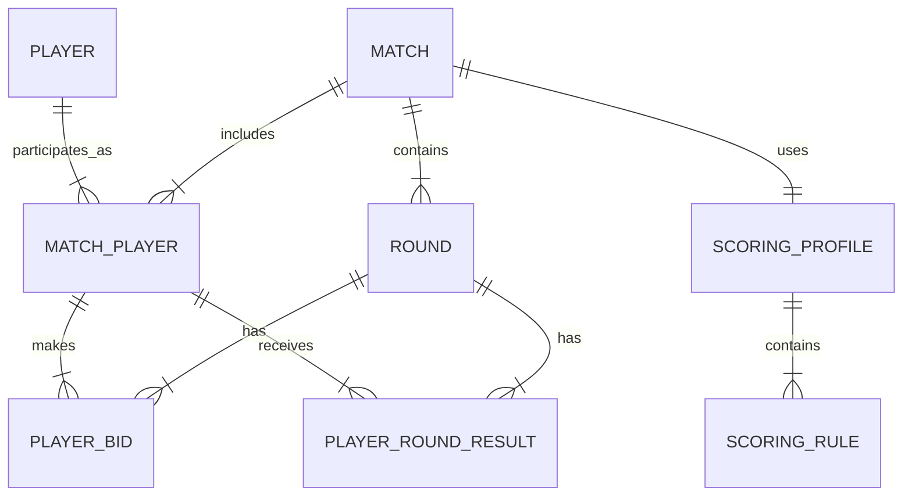
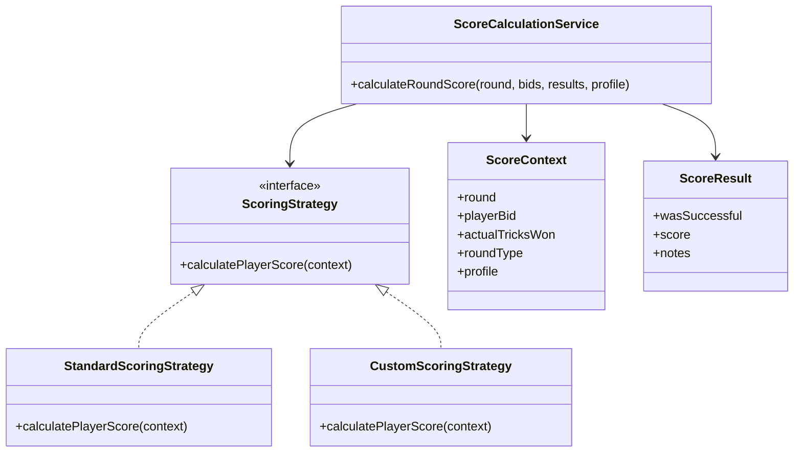

# Domain Model

## Purpose

This document defines the core domain model for the MVP score calculation app for the Egyptian Estimation card game (إستيميشن). It covers the entities, relationships, validation concepts, and score engine class model needed before UI or feature coding.

## Scope

In scope for MVP:

- Match setup
- Four players
- Round bidding
- Over / Under validation
- Actual trick entry
- Score calculation
- Running leaderboard
- Round history
- Configurable scoring profile

Out of scope for MVP:

- Online multiplayer
- Card dealing and gameplay simulation
- AI opponents
- Tournament platform
- Chat or social features

## Core Domain Rules Captured

- The game is Egyptian Estimation, not Planning Poker.
- A match has exactly four players.
- A round has 13 actual tricks.
- Total actual tricks won by all players must equal 13.
- Total estimates/bids must never equal 13.
- A round is Under when total estimates are less than 13.
- A round is Over when total estimates are greater than 13.
- Suit strength is: No Trump > Spades > Hearts > Diamonds > Clubs.
- Highest bid is resolved first by contract number, then by suit strength.
- Scoring must be profile-driven to support official and house-rule variations.

## Entity Relationship Overview



## Entities

### Match

Represents one Estimation game session.

Attributes:

- id
- name
- status: Draft | InProgress | Completed | Cancelled
- roundCount: 18 | 24
- scoringProfileId
- createdAt
- startedAt
- completedAt

Responsibilities:

- Own match settings.
- Enforce exactly four players before start.
- Own ordered round history.
- Lock scoring profile after start.

### Player

Represents a reusable person/player profile.

Attributes:

- id
- displayName
- avatarUrl optional
- createdAt

Responsibilities:

- Store player identity independently from a match.

### MatchPlayer

Represents a player's participation in a specific match.

Attributes:

- id
- matchId
- playerId
- seatNumber: 1 | 2 | 3 | 4
- displayNameSnapshot
- totalScore
- rank

Responsibilities:

- Preserve player name as used in the match.
- Track running total score.
- Support ordering and leaderboard.

### Round

Represents one scoring round.

Attributes:

- id
- matchId
- roundNumber
- status: Draft | BiddingComplete | ResultsEntered | Scored
- roundType: Over | Under
- highestBidderMatchPlayerId
- winningContractNumber
- trumpSuit
- totalEstimatedTricks
- totalActualTricks
- createdAt
- scoredAt

Responsibilities:

- Group bids and results.
- Store derived round classification.
- Store winning contract metadata.

### PlayerBid

Represents one player's bid/estimate in a round.

Attributes:

- id
- roundId
- matchPlayerId
- bidType: Normal | Dash | DashCall
- contractNumber: 0-13 optional depending on bid type
- suit: NoTrump | Spades | Hearts | Diamonds | Clubs optional depending on bid type
- bidOrder

Responsibilities:

- Capture bid input.
- Participate in bid validation.
- Participate in highest-bid resolution.

### PlayerRoundResult

Represents one player's actual result and calculated score for a round.

Attributes:

- id
- roundId
- matchPlayerId
- actualTricksWon
- wasSuccessful
- roundScore
- runningTotalAfterRound
- scoringNotes

Responsibilities:

- Store actual tricks.
- Store calculated score.
- Store running total snapshot.

### ScoringProfile

Represents the scoring rules selected before the match starts.

Attributes:

- id
- name
- type: Standard | Custom
- description
- isLocked
- createdAt

Responsibilities:

- Provide score calculation configuration.
- Allow official and house-rule variations.

### ScoringRule

Represents one configurable score behavior.

Attributes:

- id
- scoringProfileId
- ruleKey
- ruleValue
- description

Candidate rule keys:

- normalBidSuccessFormula
- normalBidFailureFormula
- dashSuccessScore
- dashFailureScore
- dashCallSuccessScore
- dashCallFailureScore
- highContractThreshold
- highContractMultiplier
- overRoundBehavior
- underRoundBehavior

## Value Objects and Enums

### Suit

Order from strongest to weakest:

1. NoTrump
2. Spades
3. Hearts
4. Diamonds
5. Clubs

### RoundType

- Over
- Under

### BidType

- Normal
- Dash
- DashCall

### MatchStatus

- Draft
- InProgress
- Completed
- Cancelled

### RoundStatus

- Draft
- BiddingComplete
- ResultsEntered
- Scored

## Domain Services

### BidValidationService

Responsibilities:

- Validate all four players submitted bids.
- Validate total estimates are not equal to 13.
- Classify round as Over or Under.
- Validate bid types are allowed by the selected scoring profile.

Key methods:

```text
validateBids(roundBids): BidValidationResult
classifyRound(totalEstimatedTricks): RoundType
```

### HighestBidResolver

Responsibilities:

- Compare normal bids by contract number.
- Break ties using suit strength.
- Return highest bidder, winning contract number, and trump suit.

Key methods:

```text
resolveHighestBid(roundBids): WinningBid
compareBids(a, b): BidComparisonResult
```

### TrickValidationService

Responsibilities:

- Validate actual tricks entered for four players.
- Ensure total actual tricks equals 13.

Key methods:

```text
validateActualTricks(roundResults): TrickValidationResult
```

### ScoreCalculationService

Responsibilities:

- Calculate score for each player in a round.
- Apply selected ScoringProfile.
- Return round scores and scoring notes.

Key methods:

```text
calculateRoundScore(round, bids, results, scoringProfile): RoundScoreResult
```

### LeaderboardService

Responsibilities:

- Recalculate running totals after each scored round.
- Recalculate all totals if a previous round is edited.
- Sort leaderboard by total score.

Key methods:

```text
recalculateMatchTotals(match): Leaderboard
rankPlayers(matchPlayers): RankedLeaderboard
```

## Score Engine Class Model



## Suggested Source Code Modules

```text
src/domain/entities/
  Match.ts
  Player.ts
  MatchPlayer.ts
  Round.ts
  PlayerBid.ts
  PlayerRoundResult.ts
  ScoringProfile.ts

src/domain/value-objects/
  Suit.ts
  Contract.ts
  Score.ts

src/domain/enums/
  RoundType.ts
  BidType.ts
  MatchStatus.ts
  RoundStatus.ts

src/domain/services/
  BidValidationService.ts
  HighestBidResolver.ts
  TrickValidationService.ts
  ScoreCalculationService.ts
  LeaderboardService.ts

src/scoring/
  ScoringStrategy.ts
  StandardScoringStrategy.ts
  CustomScoringStrategy.ts
  ScoreContext.ts
  ScoreResult.ts
```

## Validation Flow

```text
1. User enters four bids.
2. BidValidationService validates bid completeness.
3. BidValidationService calculates total estimates.
4. If total estimates = 13, block calculation.
5. If total estimates < 13, classify as Under.
6. If total estimates > 13, classify as Over.
7. HighestBidResolver determines round owner and trump suit.
8. User enters actual tricks.
9. TrickValidationService ensures total actual tricks = 13.
10. ScoreCalculationService calculates scores using selected profile.
11. LeaderboardService updates running totals.
```

## Open Rule Questions

The model intentionally supports these unresolved areas as configurable rules:

- Exact Dash declaration timing.
- Multiple Dash behavior.
- Dash Call behavior.
- Dash success and failure scoring.
- High contract scoring for 8 and above.
- Official vs house-rule score variations.

## MVP Acceptance Criteria

The domain model is ready for coding when:

- All MVP entities are represented.
- Bid validation rules are documented.
- Trick validation rules are documented.
- Highest bid resolution is deterministic.
- Score engine supports configurable scoring profiles.
- Open scoring questions are isolated from structural model decisions.
